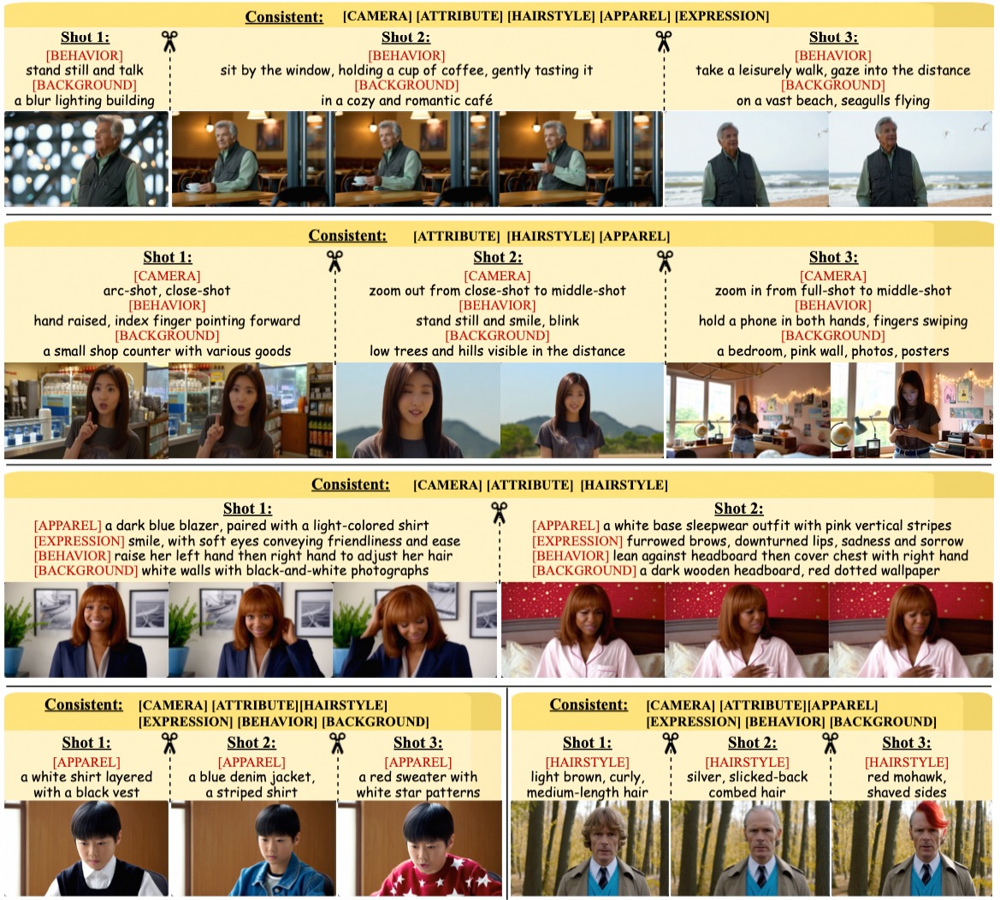

<p align="center">
  
</p>

<h1 align='center'>EchoShot: Multi-Shot Portrait Video Generation</h1>
<p align="center">
    <strong><a href="https://scholar.google.com/citations?hl=en&user=zQnTBEoAAAAJ">Jiahao Wang</a><sup>1</sup></strong>
    ·
    <strong><a href="https://scholar.google.com/citations?user=73JaDUQAAAAJ&hl=en&oi=ao">Hualian Sheng</a><sup>2</sup></strong>
    ·
    <strong><a href="https://scholar.google.com/citations?user=LMVeRVAAAAAJ&hl=en&oi=ao">Sijia Cai</a><sup>2,&dagger;</sup></strong>
    ·
    <strong><a href="https://gr.xjtu.edu.cn/web/zhangwzh123/">Weizhan Zhang</a><sup>1,*</sup></strong>
    ·
    <strong><a href="https://gr.xjtu.edu.cn/web/yancaixia">Caixia Yan</a><sup>1</sup></strong>
    ·
    <strong><a href="">Yachuang Feng</a><sup>2</sup></strong>
    .
    <strong><a href="https://scholar.google.com/citations?user=VQp_ye4AAAAJ&hl=zh-CN&oi=ao">Bing Deng</a><sup>2</sup></strong>
    .
    <strong><a href="https://scholar.google.com/citations?user=T9AzhwcAAAAJ&hl=zh-CN&oi=ao">Jieping Ye</a><sup>2</sup></strong>
    <br>
    <sup>1</sup>Xi'an Jiaotong University &nbsp;&nbsp;&nbsp;&nbsp;
    <sup>2</sup>Alibaba Cloud
    <br>
    <br>
        <a href="https://arxiv.org/abs/2506.15838"></a>
        <a href="https://johnneywang.github.io/EchoShot-webpage/"></a>
        <a href=""></a>
        <a href=""></a>
    <br>
</p>
<!-- ### [NeurIPS 2024] -->

## 📝 Intro
This is the official code of EchoShot, which allows users to generate **multiple video shots showing the same person, controlled by customized prompts**. Currently it supports text-to-multishot portrait video generation. Hope you have fun with this demo!
<div align="center">
    
</div>

<!-- ## 🌈 Gallery -->
<!-- <div align="center">
    
</div> -->

## 🔔 News
- [x] May 14, 2025: 🔥 EchoShot-1.3B is now available at [HuggingFace](https://huggingface.co/Wan-AI/Wan2.1-VACE-14B) and [ModelScope](https://www.modelscope.cn/models/Wan-AI/Wan2.1-VACE-14B)!
- [x] Mar 31, 2025: 🎉 Release code of inference and training codes. 
- [x] Mar 11, 2025: We propose [EchoShot](https://johnneywang.github.io/EchoShot-webpage/), a multi-shot portrait video generation model.

## ⚙️ Installation
Use this code to install the required packages:

    conda create -n echoshot python=3.10
    conda activate echoshot
    pip install -r requirements.txt

We recommend to organize local directories as:
```angular2html
EchoShot
├── ...
├── dataset
│   |── video
|   |   ├── 1.mp4
|   |   ├── 2.mp4
|   |   └── ...
|   └── train.json
├── models
│   └── Wan2.1-T2V-1.3B
│       └── ...
└── ...
```

## 🎬 Usage
#### Inference
We give a prompt example in __inference.json__. After adjusting the configs in __config_inference.py__, run this code to start sampling:
```
bash eval.sh
```
#### Train
If you want to train your own version of the model, please prepare the dataset, which should include video files and their corresponding JSON files. Here, we provide an example in [dataset/train.json](./dataset/train.json) for reference. All training configurations are stored in [config_train.py](./config_train.py), where you can make specific modifications according to your needs. Once everything is set up, execute the following code to start the training process:
```
bash train.sh
```

## 📖 Citation
If you are inspired by our work, please cite our paper.
```bibtex
@article{wang2025echoshot,
  title={EchoShot: Multi-Shot Portrait Video Generation},
  author={Wang, Jiahao and Sheng, Hualian and Cai, Sijia and Zhang, Weizhan and Yan, Caixia and Feng, Yachuang and Deng, Bing and Ye, Jieping},
  journal={arXiv preprint arXiv:2506.15838},
  year={2025}
}
```